 
# Missão Prática | Nível 5 | Mundo 4

### Objetivo

Este projeto esta dividido em duas fases que são :

 - Fase 1, consiste em um sistema para simulação, coleta e visualização de dados de dispositivos IoT. O projeto inclui um código Python que simula um sensor IoT, um servidor Node.js para receber e transmitir os dados, e uma interface web para visualizar esses dados em tempo real.
 
 - Fase 2 , tem o objetivo de migrar a aplicação local para a nuvem, utilizando os serviços do Azure para hospedar a aplicação e gerenciar a infraestrutura.


obs: todo projeto segue a especificação : https://sway.cloud.microsoft/s/pAU9GmfP8IF2OLSg/embed

## Fase 1: Configuração Inicial e Simulação utilizando IoT

### Configuração do Azure IoT Hub

1. **Criar um Azure IoT Hub**:
   - Acesse o portal do Azure e crie um novo IoT Hub.
   - Anote o nome do IoT Hub e a chave de conexão.

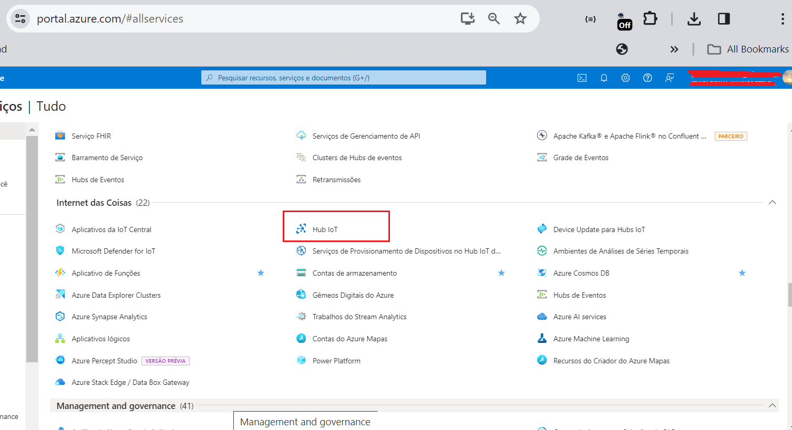

2. **Registrar um dispositivo no IoT Hub**:
   - No IoT Hub, registre um novo dispositivo e anote a string de conexão do dispositivo.

3. **Adicionar um grupo de consumidores**:
   - Adicione um grupo de consumidores ao IoT Hub para permitir a leitura de eventos.

### Configuração do Código Python (Simulador de Sensor)

#### Objetivo

O código Python simula um sensor IoT que envia dados de temperatura e umidade para o Azure IoT Hub.
    

 
#### Configuração

1. **Instalar Dependências**:
   - Instalação da biblioteca `azure-iot-device` e `python-dotenv`:
     ```sh
     pip install azure-iot-device python-dotenv
     ```

2. **Criação de um arquivo `.env`** no diretório do seu script Python com a string de conexão do 

    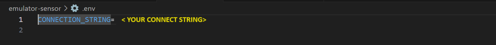

dispositivo:

  obtenha sua connect string pelo cloud shell
   ```sh
  az iot hub show-connection-string --hub-name <MyHubName> --policy-name service
   ```
e cole em

   ```sh
   CONNECTION_STRING= <MyconnectString>
   ```

3. **Executar o Script Python (simulador do sensor de temperatura)**:
   
   python sensor.py

   
   ```sh
   npm start ou pelo vscode ou apenas dando um double click no arquivo python
   ```

   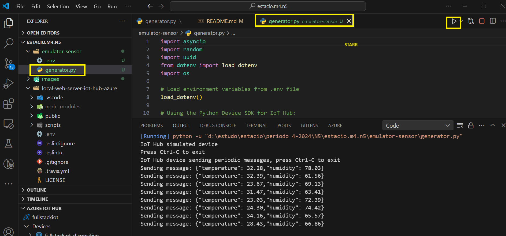
    

### Configuração do Servidor Node.js

#### Objetivo

O servidor Node.js recebe os dados do IoT Hub e os transmite via WebSocket para a interface web.

#### Configuração

1. **Instalar Dependências**:
   - Instale as dependências necessárias:
     ```sh
     npm install express http ws dotenv @azure/event-hubs
     ```

2. **Criar um arquivo `.env`** no diretório do servidor com a string de conexão do IoT Hub e o grupo de consumidores:
   ```plaintext
   IotHubConnectionString= YOUR_IOT_HUB_NAME
   EventHubConsumerGroup= YOUR_CONSUMER_GROUP_NAME
   ```

3. **Servidor Node.js (`server.js`)**:
   ```sh
   Este código configura um servidor web que serve arquivos estáticos e 
   redireciona todas as requisições para a raiz. Ele também configura um 
   WebSocket para transmitir dados recebidos vindos de 'Azure IoT Hub' para 
   todos o browse em tempo real.
   ```
4. **Executar o Servidor (o aplicativo web local)**:

### Interface Web

1. **Objetivo**:
   - A interface web se conecta ao servidor via WebSocket e exibe os dados de telemetria em tempo real.

    - Execute o arquivo 

    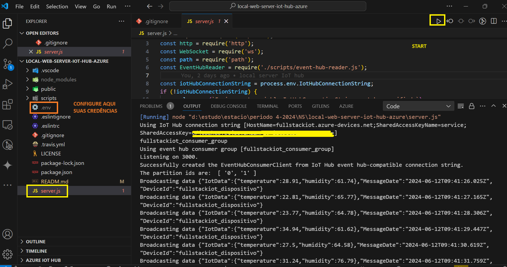

2. **Verificar a Interface**:
   - Acesse `http://localhost:3000` no seu navegador e verifique se os dados de telemetria estão sendo exibidos corretamente.
   
   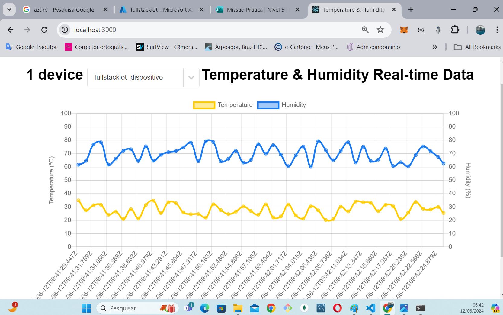

## Fase 2: Implementação na Nuvem e Integração com o Azure 

### Etapas 

1. **Criar e Configurar o Aplicativo Web no Azure**:
   1.Criação do Aplicativo Web:

   1. Acesse o portal do Azure.
     - Navegue até "Criar um recurso" e selecione "Aplicativo Web".
     - Preencha os detalhes necessários, como Nome do Aplicativo, Assinatura, Grupo de Recursos, 
       Plano de Serviço de Aplicativo, entre outros

       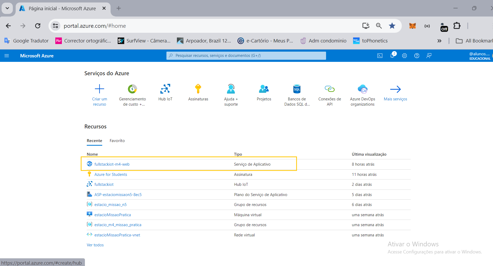
   
     - teste execução

      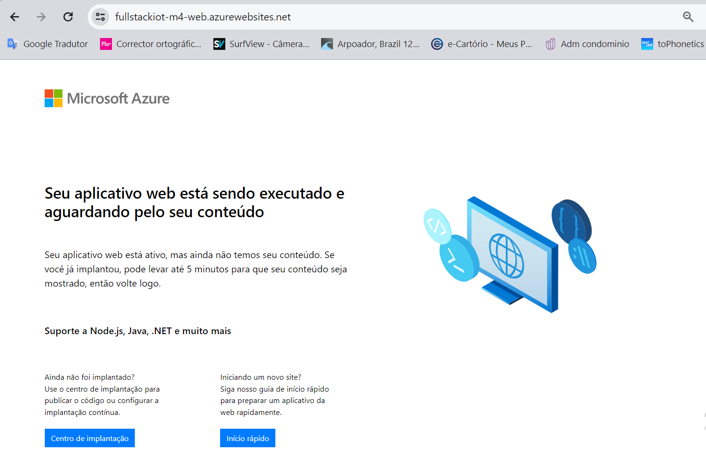

   2. Configuração Básica:

     - Após a criação, vá para a página de "Configurações" do seu aplicativo web.

     - Em "Configurações Gerais", configure o ambiente de execução (runtime stack) conforme 
       necessário (por exemplo, Node.js, .NET, etc.).

       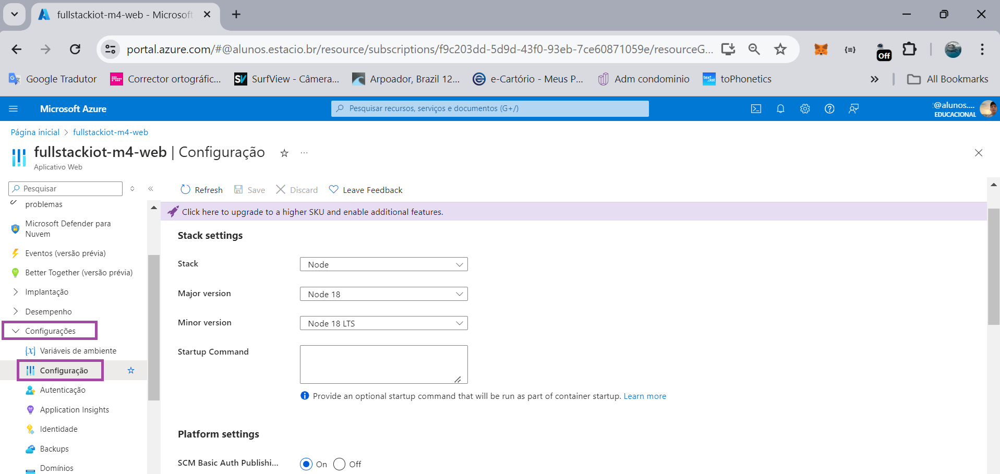

   3. Habilitar Autenticação SCM:

     - No menu lateral, selecione "Configurações" e depois "Geral".

     - Ative "SCM Basic Auth Publishing" e "FTP Basic Auth Publishing".

2. **Configuração do Repositório Git Local**:

   1. Obtenha as Credenciais do Git:

     - Navegue até "Centro de Implantação" no menu lateral.

       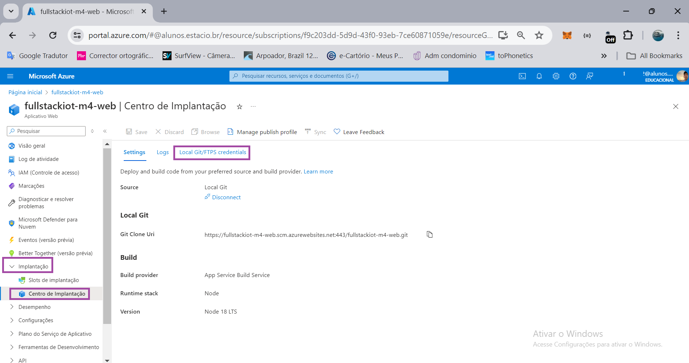

     - Selecione "Local Git/FTPS credentials" para obter o URL do repositório Git, 
        o Nome de Usuário e a Senha.

       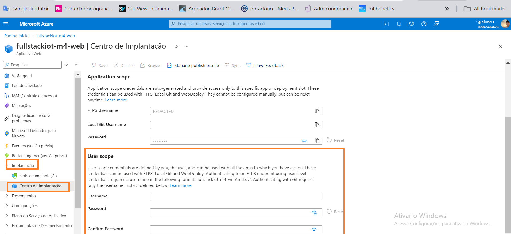
        
     - Anote essas informações, pois serão usadas para autenticação.

   2. Configurar o Repositório Localmente:

     - No terminal (PowerShell, Bash, etc.), navegue até o diretório do seu projeto.


     - Configure o repositório remoto com as credenciais obtidas:   
     
      ```sh
     git remote remove azure
     git remote add azure https://<username>:<password>@<seu_app>.scm.azurewebsites.net:443/<seu_app>.git
      ``` 

2. **Realizar atualização para o repositorio git Azure**:

- No terminal faça o 'git clone' apenas do projeto 'Servirdor Node.js'

  obs1: para isso vc precisará ter o projeto separado em um repositório

  - após clonar o projeto, entre na pasta e configure o arquivo .env não 
   esquendo de remover a referencia do arquivo local ''.gitignore'
  - realize o 'git add .'
  - realize o 'git commit -m "SUA DESCRIÇÃO"
  - realize o 'git push -u azure master'

  se quiser pode conferir o push no repositório git do azure

  - acesse o meu lateral ferramentas de seu web app e acesse o link 'ir'

       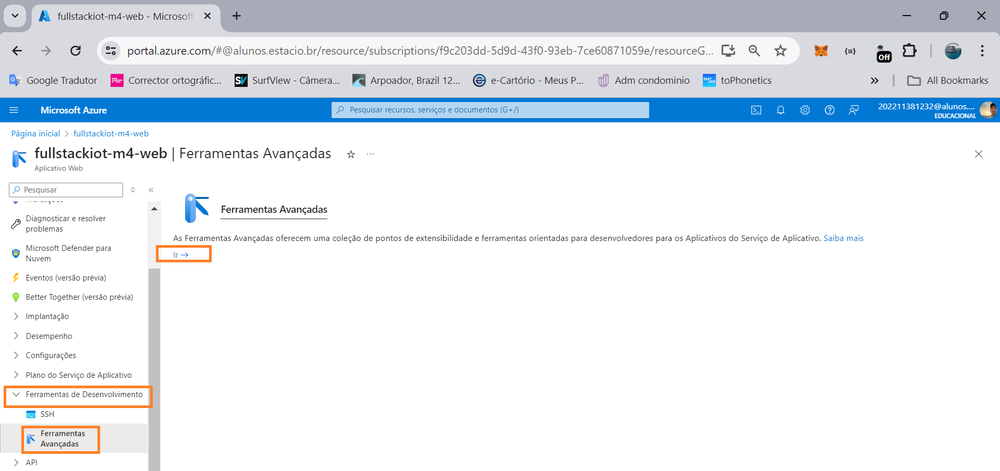

  - em Azure App Service selecione o menu 'Bash' 

       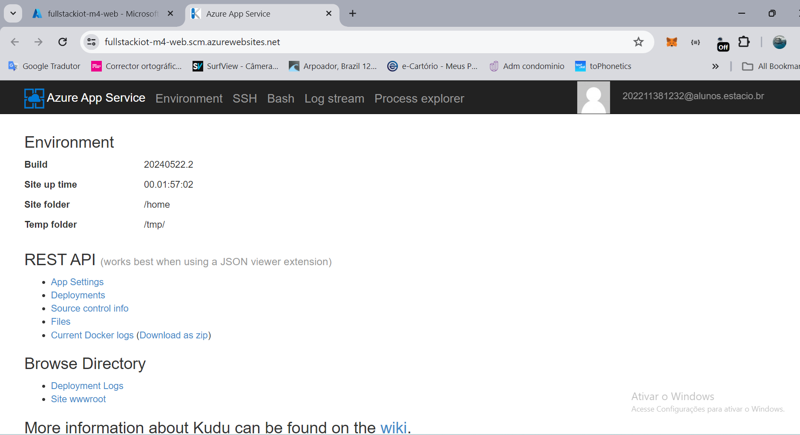

  - acesse o kunduru console 

       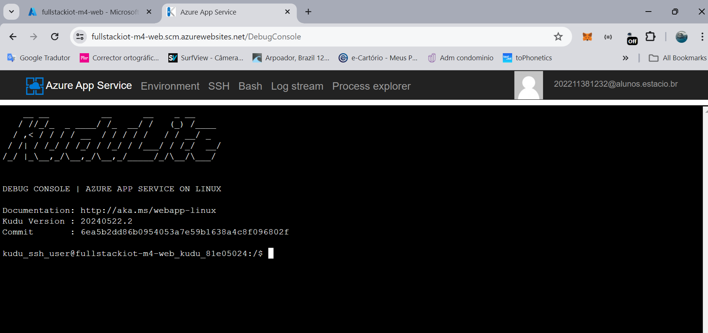

  - liste as pastas e acesse  'site/wwwroot' 

       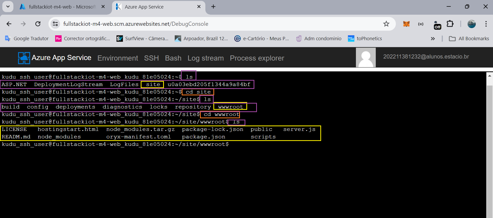


3. **Verificar a Implantação**:

   2.  Testar a Aplicação:

     - Ative o emulador local em python do sensor de umidade

        ```sh
        npm start ou pelo vscode ou apenas dando um double click no arquivo python
        
        ```

   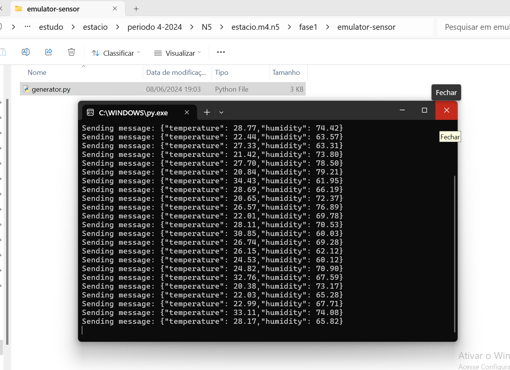


     - Acesse a URL do seu aplicativo web para verificar se está funcionando conforme esperado.

 
    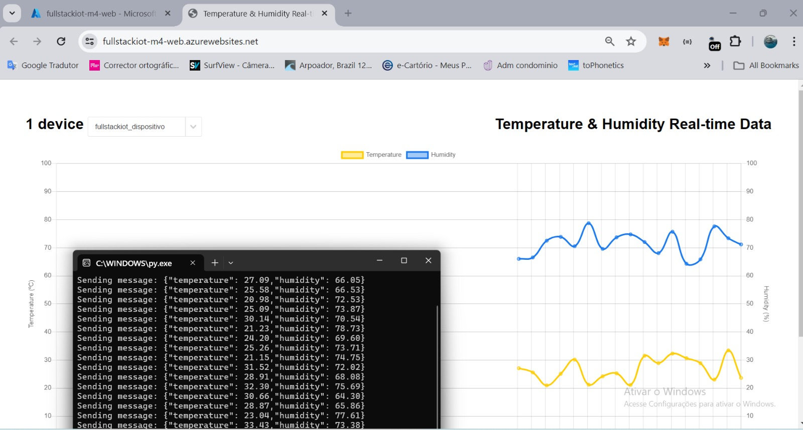
    


